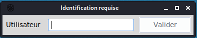
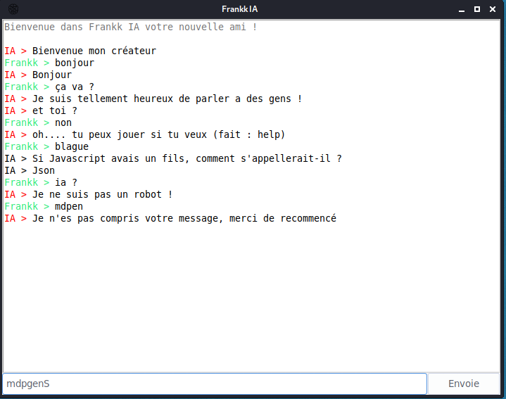
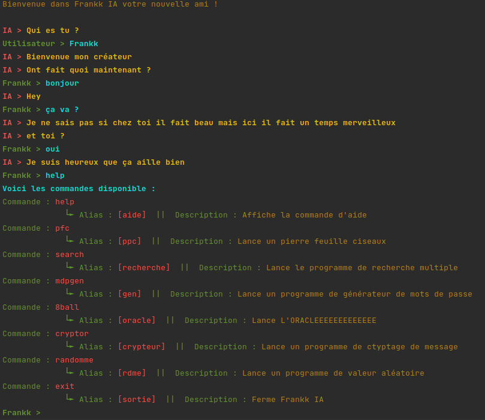

# Frankk IA

__Voici mon premier programme python sous l'idée d'un chatbox__

## 1. Présentation

Frankk IA es un petit programme sous forme de terminal ou d'interface graphique, qui repond a certaine phrase et inclu
quelque petite commandes amusante et pratique

## 2. Connaissances

* **Les phrase es mots compris**

*bonjour, salut, hello, hi, hey, ça va ?, comment ça va ?, tu vas bien ?, oui, super, non, bof, tu es un robot ?, robot ?, tu es une ia ?, ia ?, comment t'appelles-tu ?, quelle est ton nom ?, tu t'appelles comment ?*

* **Les réponses possible**

*Salut, Bonjour, Bien et toi ?, Je suis heureux que ça aille bien, oh.... tu peut jouer si tu veut (fait : help), Je ne suis pas un robot !, Je ne pense pas et toi ?*

* **Commandes**
   
*mdpgen, 8ball, search, pfc, exit, sortie, help, aide, gen, oracle, ppc, recherche, info, cryptor, crypteur*

* **Humour**
   
*blague, fait moi une blague, raconte moi une blague*

## 3. Détail des options  

commande : `help` `aide`

> Lance la commande d'aide

commande : `mdpgen` `gen`

> Génere des mots de passe, il y a different options possible :
>> [1] Faible : 6 carractére aléatoire  
>> [2] Moyen : 8 carractére aléatoire  
>> [3] Fort : 16 carractére aléatoire  
>> [4] Military : 32 carractére aléatoire  
>> [5] Perso : vous définisser chaque paramètre  
>> [6] Phrase : modifie une phrase de votre choix

commande : `8ball` `oracle`

> Répond aléatoirement à la phrase donnée, serait-ce la réponse du destin ?

commande : `search` `recherche`

> Lance une multiple recherche sur different moteur de recherche

commande : `pfc` `ppc`

> Lance un pierre feuille ciseaux

commande : `info`

> Affiche les informations du programme

commande : `cryptor` `crypteur`

> Programme de cryptage et décryptage avec actuellement :
> > * ROT13  
> > * césar
> > * vigenère

commande : `randomme` `rdme`

> Programme d'options aléatoire : 
> >[1]  chiffre aléatoire entre 0 et 1000  
> >[2]  chiffre aléatoire entre deux valeurs définit par vous  
> >[3]  mot aléatoire en français  
> >[4]  mot aléatoire en anglais  
> >[5]  blague aléatoire  

commande : `exit` `sortie`

> Ferme Frankk IA

## 4. Vue du programme

####GUI :  

####Terminale :   

